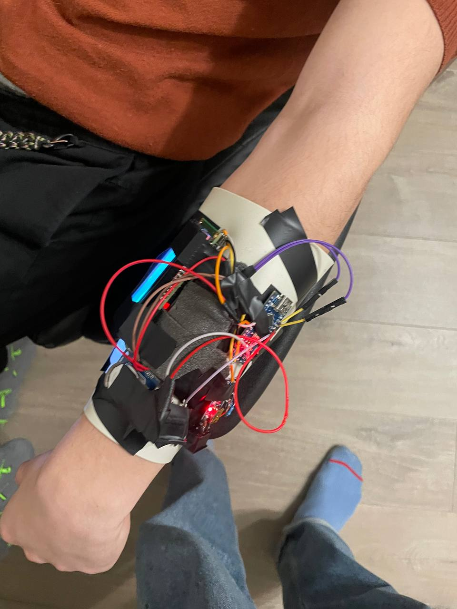

# ttvv

TTVV is a Touch Time Via Vibration approach of extended human senses

To track the current status - https://trello.com/b/p5ueh8MM/ttvv-time-touch-via-vibration

## March status

### Advantages
- flexible
- independent
- relatively movement-resistant
- display shows current time and sector

### Disadvantages
- loud
- huge
- some pattern felt not ok

## April status

### Advantages
- flexible
- independent
- relatively movement-resistant
- **not loud**
- **convenient on-hand prototype**
- easier experiments

### Disadvantages
- huge anyway, may be smaller
- bad soldering
- sometimes breaks up, need to be restarted by on-off switcher
